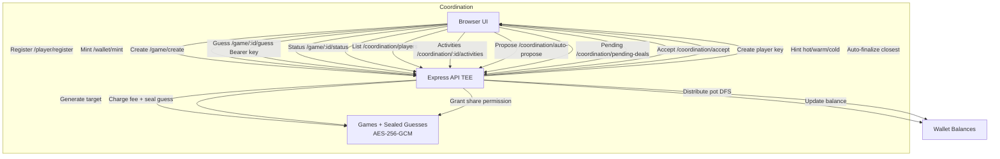

# EigenX TEE TypeScript Application

The game is a sealed number-guessing contest where players submit guesses within a range and get immediate hot/warm/cold feedback without revealing their numbers. A correct guess ends the game and wins the pot; otherwise at the deadline the closest guess wins the accumulated fees.

## Requirements

- Node.js 20+
- npm
- eigenx CLI 

## Environment

The app requires the following environment variables:

- `MNEMONIC` (optional): Seed phrase used to derive a sealing key - automatically generated if not provided by Compute.
- `PORT` (optional): HTTP port, defaults to `3000`.

Create a `.env` file in the project root:

```bash
MNEMONIC="your twelve or twenty-four word phrase here"
PORT=3000
```

## Install & Run (Local)

```bash
npm install
npx ts-node src/index.ts
```

Then open `http://localhost:3000/`.

## Build (optional)

If you prefer compiled output:

```bash
npm run build
node dist/index.js
```

## Docker

The provided `Dockerfile` runs the app directly from `src/` using `ts-node`.

Build the image:

```bash
docker build -t eigenx-app .
```

Run (ensure `MNEMONIC` is provided):

```bash
docker run --rm -p 3000:3000 \
  -e MNEMONIC="your mnemonic" \
  -e PORT=3000 \
  eigenx-app
```

Open `http://localhost:3000/`.

## How To Deploy on EigenCompute

TBD.

## API Overview

- `GET /health`: Health check
- `POST /player/register`: Create a player key for a `playerId`
- `GET /wallet/:playerId/balance`
- `POST /wallet/mint`
- `POST /game/create`
- `POST /game/:gameId/guess`
- `GET /game/:gameId/status`
- `GET /coordination/players`
- `GET /coordination/:gameId/activities`
- `POST /coordination/auto-propose`
- `GET /coordination/pending-deals`
- `POST /coordination/accept`

The `public/` app provides a minimal UI to interact with these endpoints.


## Architecture Diagram



